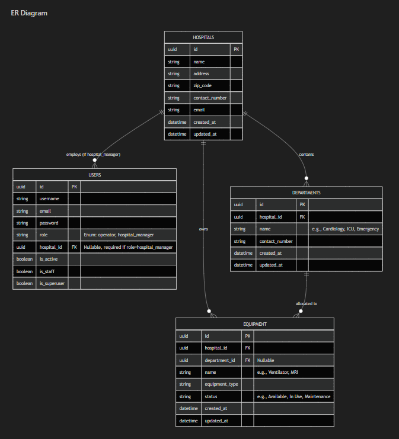

# PRATIRAKSHA

## Intelligent Hospital Management & Predictive Analytics Platform

Pratiraksha is an intelligent healthcare management platform designed to improve operational efficiency, resource utilization, and emergency preparedness within hospitals. By combining modern web technologies with machine learning, the platform enables healthcare administrators to monitor hospital operations in real time, anticipate patient surges before they occur, and make informed decisions based on predictive analytics.

Healthcare systems often rely on fragmented information, manual coordination, and reactive decision-making during periods of increased demand. Pratiraksha aims to address these challenges by providing a centralized platform that integrates hospital management, live operational monitoring, predictive intelligence, and crisis simulation into a unified ecosystem.

The platform is built around the idea that hospitals should be able to prepare for emergencies rather than simply respond to them. Through continuous monitoring of hospital capacity, environmental conditions, and operational metrics, Pratiraksha delivers actionable insights that help administrators allocate resources efficiently and improve patient outcomes.

---

## Vision

To build a modern, scalable, and intelligent healthcare platform that empowers hospitals with real-time operational awareness, predictive analytics, and AI-driven decision support for proactive healthcare management.

---

## Problem Statement

Healthcare institutions face several operational challenges that directly affect patient care and resource management, including:

* Unpredictable patient surges during festivals, seasonal outbreaks, pollution spikes, and public events.
* Inefficient allocation of hospital resources such as beds, ICU units, medical equipment, and healthcare staff.
* Limited visibility into real-time hospital operations.
* Delayed emergency response caused by fragmented information systems.
* Lack of predictive tools that assist administrators in planning ahead rather than reacting after problems occur.

Pratiraksha addresses these challenges by bringing operational management and predictive intelligence together within a single integrated platform.

---

## Core Capabilities

The platform provides a comprehensive set of capabilities designed for modern healthcare institutions:

* Secure authentication and role-based access control for administrators, operators, and healthcare personnel.
* Centralized hospital management with detailed information about facilities, departments, capacity, and operational status.
* Real-time monitoring of hospital occupancy, available resources, and critical operational metrics.
* AI-powered patient surge prediction using machine learning models trained on environmental and operational data.
* Crisis simulation for evaluating emergency scenarios and estimating resource requirements.
* Interactive analytics dashboards for monitoring key performance indicators and long-term operational trends.
* Live notifications powered by WebSocket communication for immediate awareness of critical events.
* Scalable backend architecture capable of supporting multiple hospitals and future healthcare integrations.

---

## Technology Stack

| Category | Technologies |
|:---------|:-------------|
| **Frontend** |  React Query, Zustand, React Hook Form |
| **Backend** |  Django REST Framework, Django Channels, Celery |
| **Artificial Intelligence** |  Scikit-learn, Pandas, NumPy |
| **Data Layer** |  |
| **Infrastructure** |  |

---

## System Architecture

Pratiraksha follows a modular, service-oriented architecture where each layer is responsible for a specific aspect of the platform.

The frontend provides an intuitive user interface for hospital administrators and healthcare personnel. Requests are processed through a Django REST API responsible for authentication, business logic, validation, and data management. Real-time communication is handled using Django Channels with Redis acting as the messaging layer.

Machine learning inference is isolated within a dedicated FastAPI service responsible for patient surge prediction and future AI models. Persistent operational data is stored in PostgreSQL, while MongoDB is used for prediction history, analytics, and flexible document storage. Redis provides caching, asynchronous task processing, and real-time communication support.

This architecture enables independent scaling of the frontend, backend, machine learning services, and supporting infrastructure while maintaining a clean separation of responsibilities.

---

## ER Diagram

---

## Design Principles

The platform is developed around several guiding principles:

* Scalability through modular architecture.
* Security by design using industry-standard authentication and authorization practices.
* High performance through caching, asynchronous processing, and optimized database design.
* Maintainability through clean architecture and separation of concerns.
* Extensibility for future healthcare integrations and advanced AI capabilities.
* Reliability with fault-tolerant services and production-ready deployment practices.

---

## Future Scope

Pratiraksha is designed to evolve into a comprehensive intelligent healthcare ecosystem. Planned enhancements include advanced machine learning models, multi-hospital coordination, interactive geospatial visualization, mobile applications, automated report generation, IoT device integration, external healthcare system interoperability, AI-assisted resource optimization, and predictive operational planning.

As the platform matures, it aims to provide healthcare organizations with a complete decision-support system capable of transforming hospital operations through data-driven intelligence.
